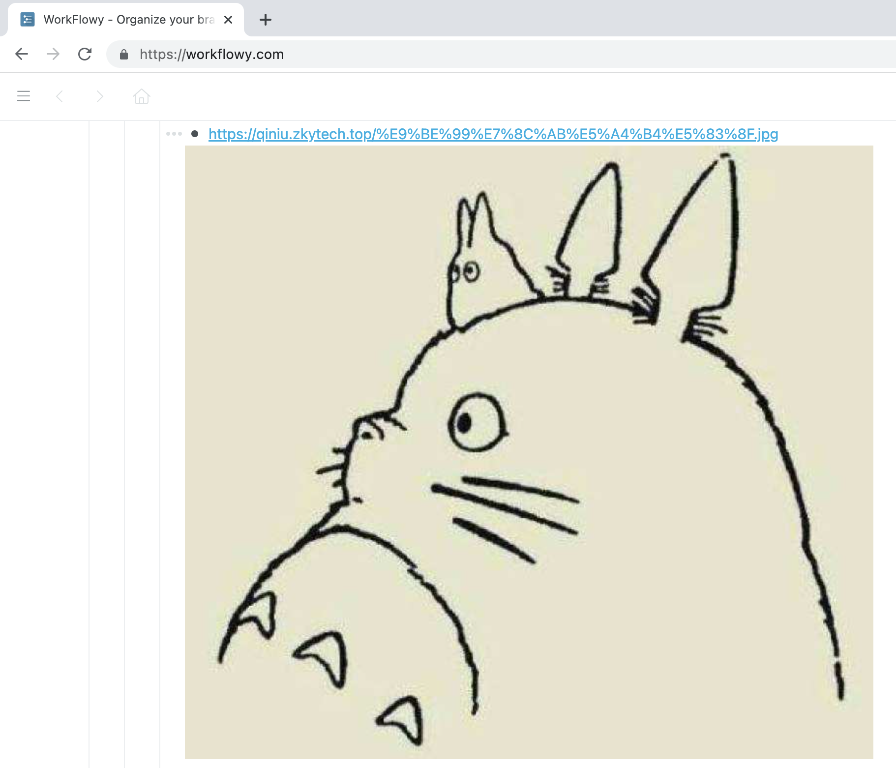
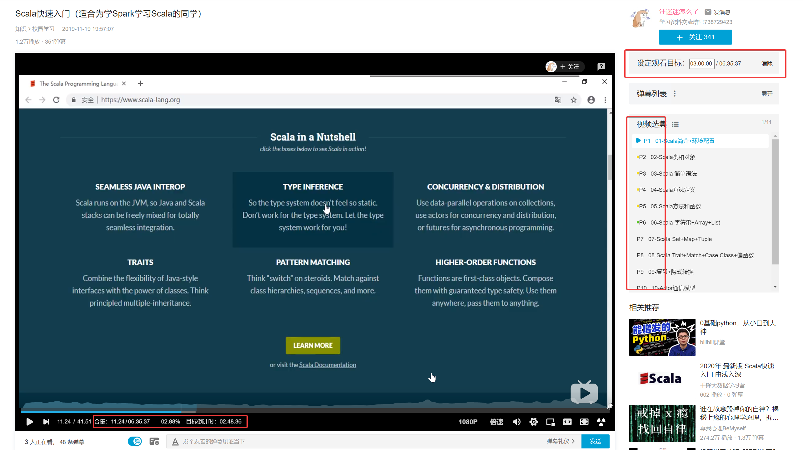

# Tampermonkey_scripts
[toc]

自己写的一些油猴脚本

> 使用前必须先在浏览器上安装[Tampermonkey](https://chrome.google.com/webstore/detail/tampermonkey/dhdgffkkebhmkfjojejmpbldmpobfkfo?utm_source=chrome-ntp-icon)插件

## 1.Workflowy图片链接渲染

使用方法，将图片链接粘贴到workflowy即可。

## 2.Bilibili增强--合集观看进度显示

[点击安装脚本](https://github.com/zkytech/Tampermonkey_scripts/raw/master/bilibili-collection-enhance.user.js)

适用人群：**考研**、**自学**

显示B站视频合集**整体**观看进度，方便掌控学习进度，合理安排学习时间。

主要功能：

1. 显示视频合集整体观看进度

2. 设定合集观看目标：设定观看目标之后，会自动标记出所有待观看的分P

